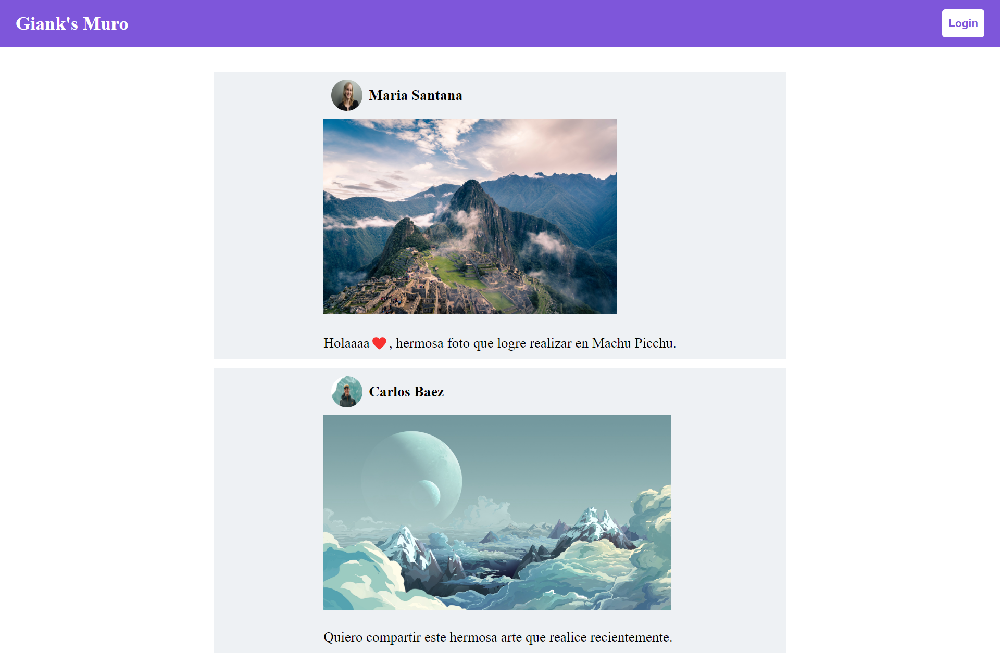
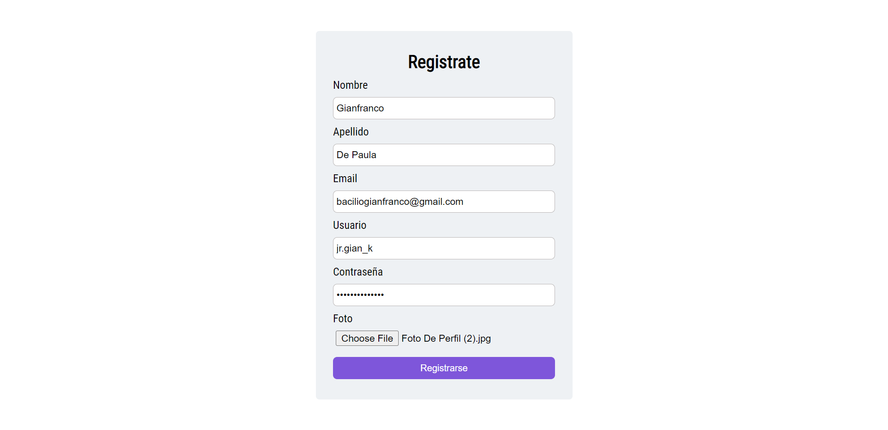
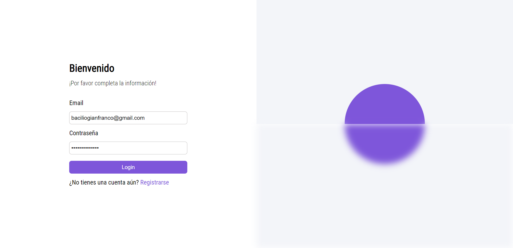
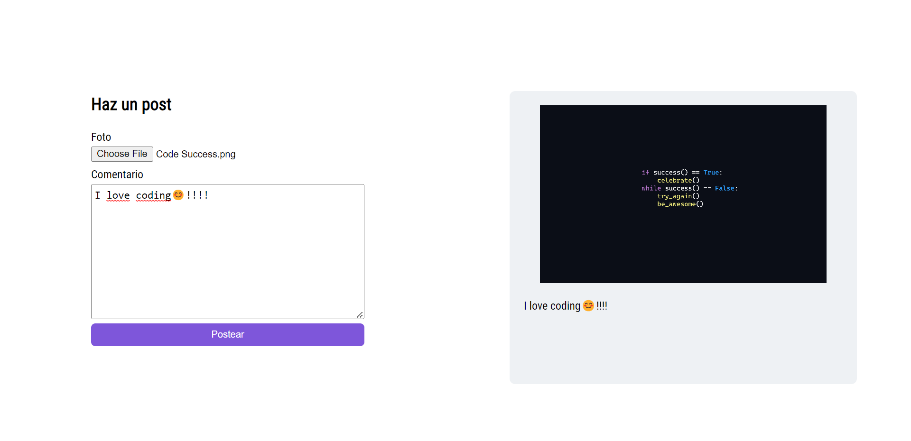

## Proyecto Final -juan pablo cespedes mota (20197803)

### Muro Interactivo

Independientemente del tema escogido para el proyecto final se espera que se utilice javascript
(ES6), el framework React y Firebase como tecnología para el backend.

Haga un sistema WEB que permita a los visitantes las siguientes funcionalidades:

1. Ver todas las publicaciones hechas por todos los usuarios (No requiere autenticación)
2. Crear una cuenta de usuario (del usuario se guardará: usuario, clave nombre, apellido)
3. Iniciar Sesión
4. Publicar nuevos posts (Solo usuarios autenticados)

### 1. Muro sin login

En la vista principal es donde podemos ver los posts de los usuarios, cuando no se esta autenticado solo aparecen los posts y un botón mediante el cual puedes dirigirte al login.

### 2. Registro

Esta es la vista mediante la cual podemos registrarnos en la aplicación, el usuario puede registrar su nombre de usuario, foto de perfil, nombre, apellido y sus credenciales para inicio de sesión.

### 3. Login

Mediante esta vista los usuarios ya registrados pueden autenticarse y dirigirse a la vista principal.

### 4. Nuevo post

Vista mediante el cual se suben los nuevos posts, podemos observar que hay un preview de como se veria el post que se esta por subir.

